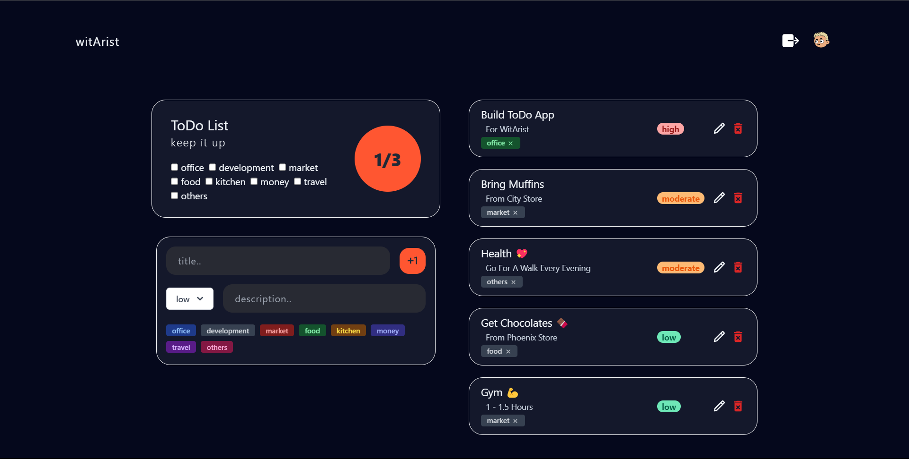

# Installation

To run the ToDo Application.
1. **Clone the Repository:** Clone the ToDo Application repository to your local machine using the following command:
```javascript
https://github.com/Abhigyan-Sh/witArist.git
```
2. **Navigate to the Project Directory:** Change your current directory to the root directory of the cloned repository and execute following command in terminal:
```javascript
cd client
```
3. **Install Dependencies:** Install the necessary dependencies required to run the application. Assuming you have Node.js installed, run:
```javascript
yarn install
```
4. **Navigate to the Backend directory**: Change your current directory to the backend directory of the cloned repository:
```javascript
cd backend
```
Now Install the necessary dependencies
```javascript
yarn install
```
5. **Start the Application**: Start the ToDo application by executing the following command:
```javascript
npm run dev
```

**Access the Application:** Once the application is running, access it through your web browser at the specified address - http://localhost:5173

**Also Visit the deployed URL:** [visit the site..](https://wit-arist.vercel.app/)

## Application UI


## Features
1. Seamlessly manage your daily tasks with options to **create**, **update**, and **delete** them.
2. Organize tasks effortlessly into **categories** for improved clarity.
3. Prioritize your tasks with ease by assigning them to **high**, **moderate**, or **low priority levels** thus ensuring efficient management even amidst chaos.
4. Provide detailed **descriptions** for tasks, facilitating better understanding.
5. **filter your tasks** according to your needs of the hour or just to get better clarity and focus.